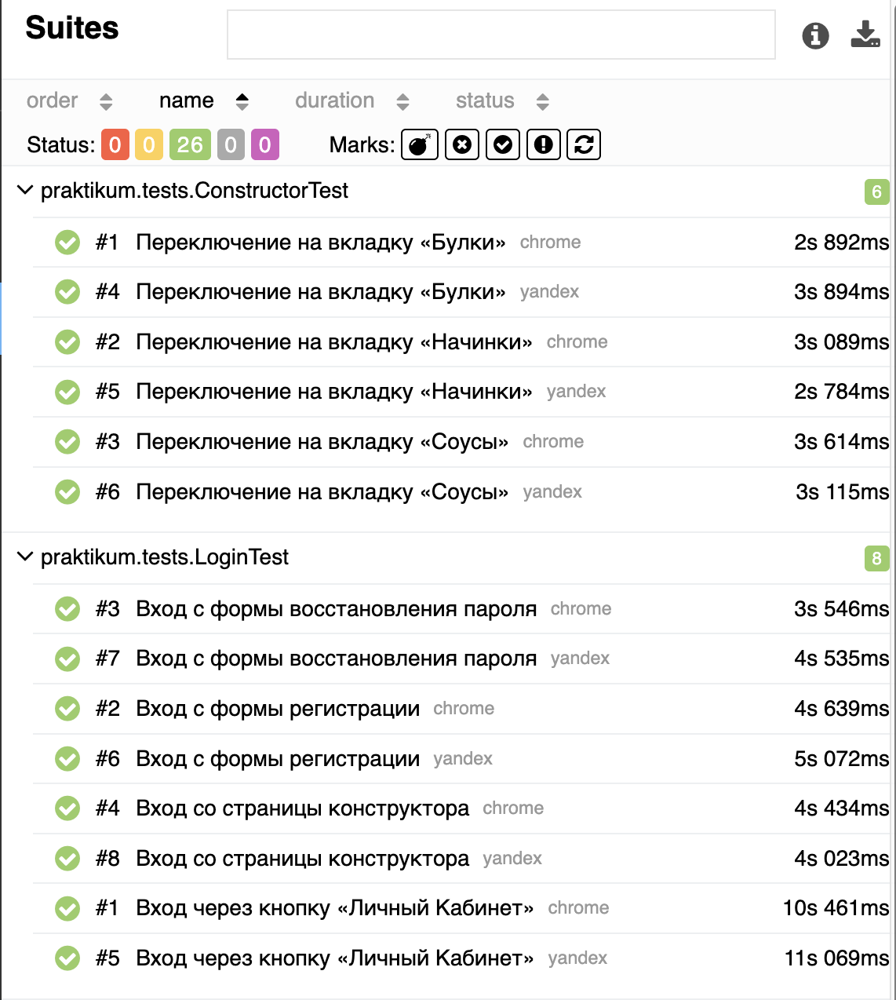
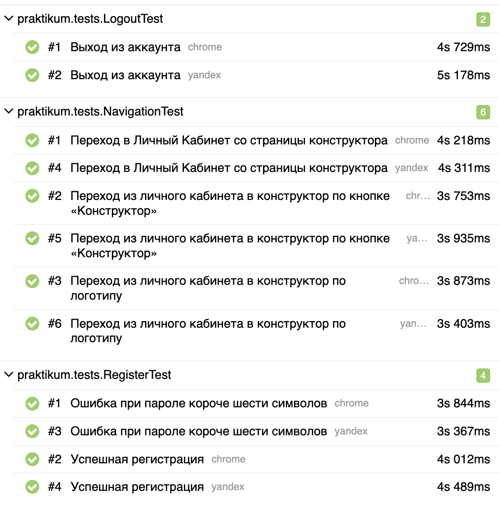

# Stellar Burgers — UI-автотесты

Дипломный проект Яндекс Практикума (Diplom_3): UI-автотесты учебного веб-приложения
Stellar Burgers.

Стенд: `https://qa-stellarburgers.education-services.ru/`

## Стек

- Java 11
- Maven
- JUnit 5 (`junit-jupiter`)
- Selenium 4
- RestAssured + Jackson (создание и удаление пользователя через API)
- Lombok
- Allure (`allure-junit5`, AspectJ)

## Как запустить тесты

Из корня проекта (рядом с `pom.xml`).

Google Chrome (браузер по умолчанию):

```bash
mvn clean test
```

Яндекс.Браузер:

```bash
mvn clean test -Dbrowser=yandex
```

Отчёт Allure (после прогона тестов):

```bash
mvn allure:serve
```




